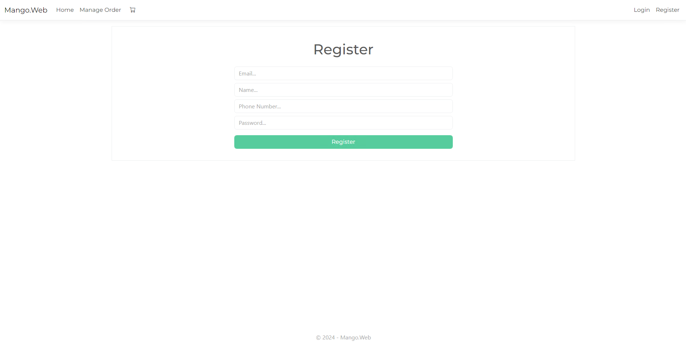
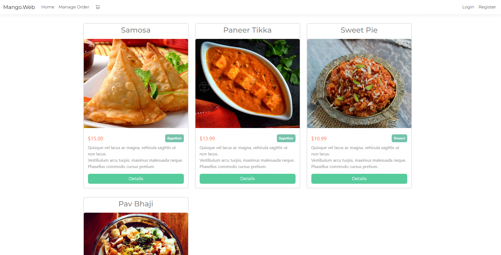
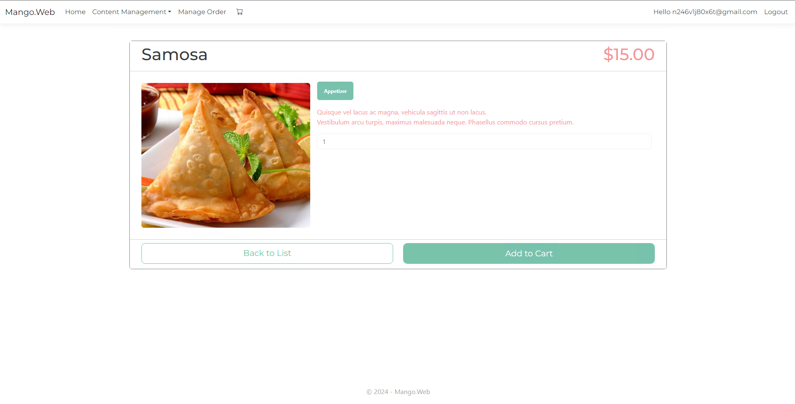
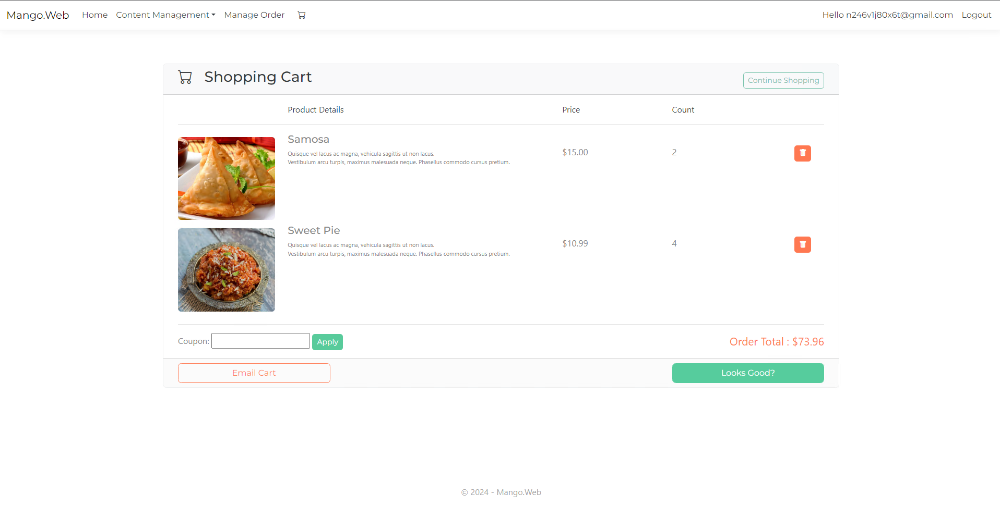
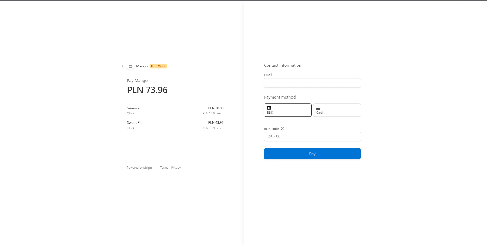
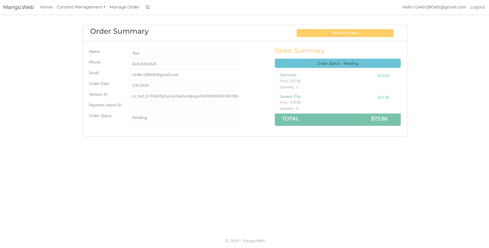

# Mango Store

MangoStore is a microservices-based web store developed on the ASP.NET platform using MinimalAPI and other modern technologies. Each microservice, such as product management, shopping cart, order processing, payment handling, and notification sending, is represented as a separate component, providing flexibility and scalability to the system.

## Technologies Used

- C#
- ASP.NET
- MinimalAPI
- Entity Framework Core (EF Core)
- Swagger
- HTML/CSS/JS
- RabbitMQ
- Azure Service Bus
- Azure Queue
- Stripe (for payment processing)
- Bootstrap v5

## Features

### Registration Page

New users can register for an account on the registration page to access additional features and track their orders.

### Product Page

On the product page, users can view detailed information about the product, its description, price, and add it to the shopping cart.

### Shopping Cart

In the shopping cart, users can manage added items, adjust their quantities, and proceed to checkout.

### Payment Pages

Users are redirected to secure payment pages where they input their payment details to finalize the order.

### Order Status Page

After placing an order, users can check the status of their order on the order status page.

## License

>You can check out the full license [here](https://github.com/ymatko/microservices-mango/blob/main/LICENSE.txt).

This project is licensed under the terms of the MIT license.
